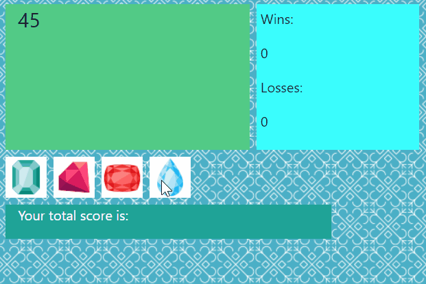

# Crystal Collector

### Description

Crystal Collector is a game where each crystal is assigned a random value.  Players click the crystals in an attempt to match the given, but random target number.  If you go over the target number, you lose!  This game makes use of Javascript Math functions.

## Built on

* Javascript
* HTML
* CSS

### Deployed Site

You can play this game [here](https://andrew-stehno.github.io/unit-4-game/).

